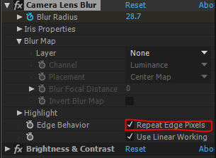

# Adobe After Effects

- [Links](#links)
  - [Useful](#useful)
- [Defs](#defs)
- [Notes](#notes)
- [Effects](#effects)

## Links

### Useful

  - [Extend effect beyond layer boundary](https://forums.creativecow.net/thread/2/1094938)
  - [10 Essential After Effects Shortcuts](https://www.premiumbeat.com/blog/10-essential-after-effects-shortcuts/)

## Defs

- CTI $\equiv$ Current Time Indicator

## Notes

1. Sometimes effects just doesn't fill up whole comp, so they need to be expanded by `Grow Bounds`.

2. For inserting a keyframe use `ALT + SHIFT + property`.
   - `property` $\in$ $\{$ pos, rot, scale, … $\}$

3. For transparent backgrounds in comps use:
    

4. When blurring, you don't want to those edges
that are blurred to making blue box with
white blurred borders. Just check:
    

5. For keyframe scaling, drag the keyframes at the opposite side of CTI while holding down alt key.

## Effects

1. CC Radial Fast Blur
   - sun beams
   - light it up beams
