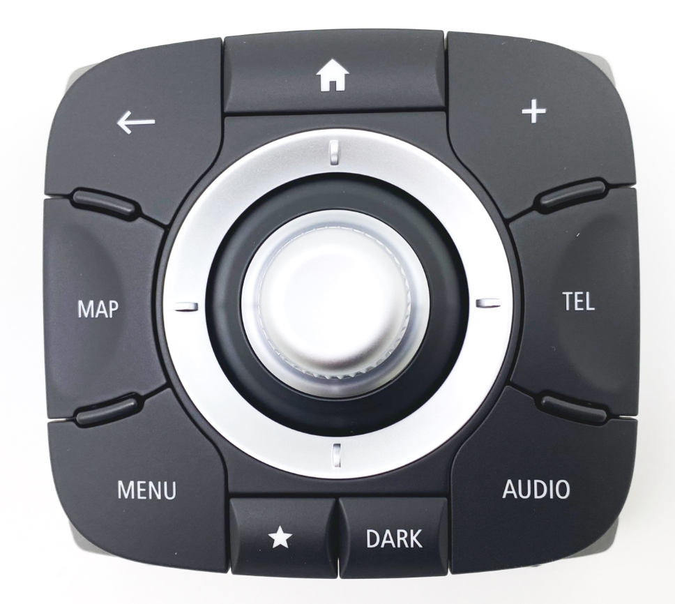
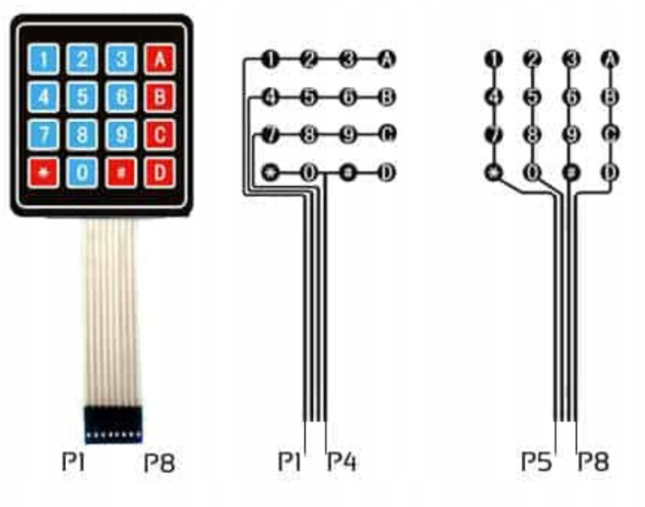
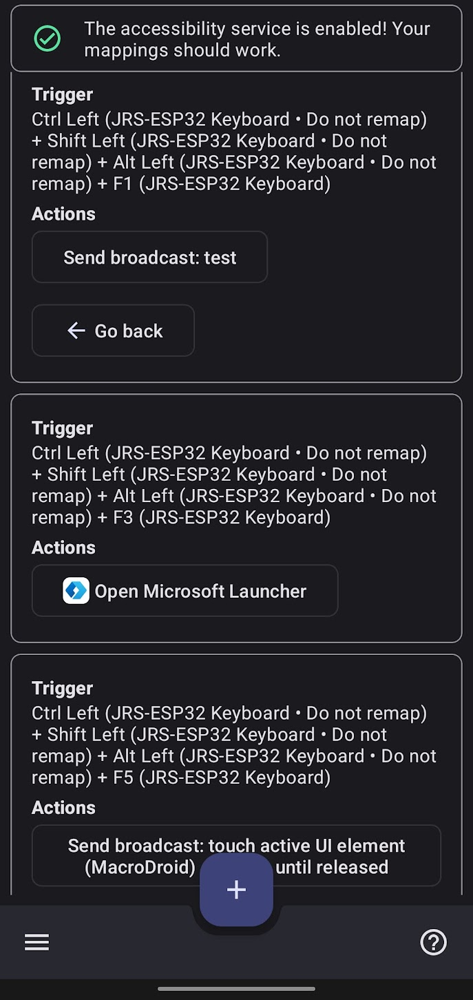

## Renault Samsung Control Panel



This is the control panel used in Renault Laguna III cars produced between
2013 and 2015.
My car is from 2012.
It is a Laguna III PH2, so the first “lifting” version of the car.
The second “lifting” version brought R-Link which later could have been
upgraded to enable Android Auto, and because of that it had a different
set of button labels.
My car has a TomTom Live navigation system, instead of R-Link,
thus I don’t have the option to use Android Auto by the book,
and the button labels were oriented towards this deprecated navigation
system.

That’s why, I’m adapting the new control panel,
to my Bluetooth-capable ESP32 Arduino board,
which I’m going to control my Android phone with.
This enables me to have a safer and more comfortable interface
than the phone touch screen which isn’t very accessible while driving.

---


## Resources used:

- Brian Lough’s:
    - [YT Video tutorial — Bluetooth HID using just an ESP32](https://www.youtube.com/watch?v=4sIkW7wogrE&ab_channel=BrianLough)
    - [GitHub repository containing the Arduino code — arudino-switcheroonie](https://github.com/witnessmenow/arduino-switcheroonie)
        — I’ve repurposed Brian’s code for my use-case
- [List of Android keycodes](https://developer.android.com/reference/android/view/KeyEvent#KEYCODE_BOOKMARK)
- An Android phone connected via USB and `adb` and its commands like `input keyevent`
- [ESP32 BLE Keyboard Arduino library](https://github.com/T-vK/ESP32-BLE-Keyboard)
- [ESP32 hardware Arduino board](https://sklep.msalamon.pl/produkt/esp32-devkit-esp-wroom-32-v2/)
- [MacroDroid — Android app for running macros](https://play.google.com/store/apps/details?id=com.arlosoft.macrodroid&gl=PL)
- [Key Mapper — Android app for remapping key events](https://play.google.com/store/apps/details?id=io.github.sds100.keymapper&gl=PL)

---


## Interface

[The Arduino adapter](arduino/test_shortcut_keyboard/renault_control_panel_adapter.ino)

I used a simple four by four keypad for testing purposes,
the same one that Brian Lough used when building his macro keypad.




### Navigating Android interface

I’m using the arrow, and tab keys for basic navigation.
The ESP32 board is sending keycodes to the phone,
as it is recognized as a standard Bluetooth keyboard.
This is done via Arduino BLE keyboard library.

e.g.:
```c
case '2':
    bleDevice.press(KEY_UP_ARROW);
    break;
```

The joystick in the middle of the Renault control panel is used for navigation.
It can be rocked up, down, left, right
(which is translated to keyboard arrow keys)
and it also be rotated clockwise and anti-clockwise
(which is translated to keyboard tab and shift+tab).


### Media buttons

For other buttons like ‘Home’, ‘Map’, ‘Audio’, etc. the Arduino controller
sends macros that are then remapped via aforementioned app (Key Mapper).

```c
void pressMacroKey(uint8_t key) {
    bleDevice.press(KEY_LEFT_CTRL);
    bleDevice.press(KEY_LEFT_SHIFT);
    bleDevice.press(KEY_LEFT_ALT);
    bleDevice.press(key);
}

// […]

case '1':
    pressMacroKey(KEY_F1);
    break;
```

Example mappings:



I’m using a different launcher for this “car mode” to separate between
normal phone use (when not in car) and car infotainment system–like use.
