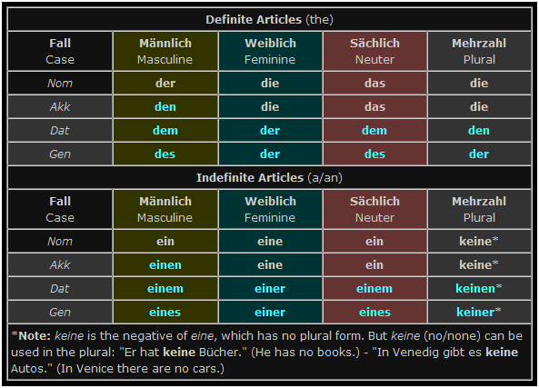

# German

- [Index](#index)
- [Links](#links)
- [Handy](#handy)

## Index

  - [**Expression map**](expressions.md)
  - [Words](words.md)
  - [Verb conjugation](verb-conjugation.md)
  - [Präpositionen](präpositionen.md)
  - [Text analysis](text-analysis/readme.md)

## Links

  - [Toms Deutschseite](http://www.deutschseite.de/inhalt.html)
  - [Nico DW - Adventure to Germany](https://www.youtube.com/watch?v=pMBvpCLflqU&feature=youtu.be)

## Handy

