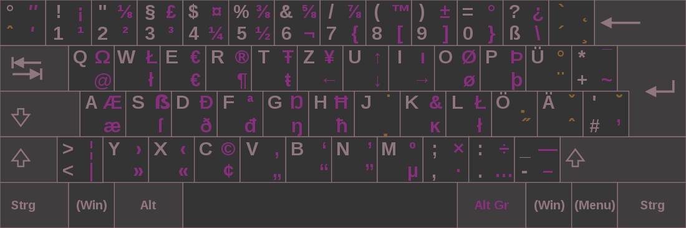

# Deutsch

*German*

- [Resources](#resources)
    - [News articles](#news-articles)
    - [Toms Deutschseite](#toms-deutschseite)
- [Notizen](#notizen)
- [Handy](#handy)
- [Text analysis](#text-analysis)

---

## Resources

### News articles
- [NachrichtenLeicht](https://www.nachrichtenleicht.de)
- [Deutsche Welle](https://www.dw.com/de)

### Toms Deutschseite
- [Toms Deutschseite](http://www.deutschseite.de/inhalt.html)

---

## Notizen
- [**Präpositionen**](notizen/präpositionen.md)
- [Verb conjugation](notizen/verben-konjugation.md)
- [Expression map](notizen/ausdrücke.md)
- [Words](notizen/wörter.md)

---

## Handy

---

## Text analysis

*Dokument, Artikeln und andere Texten kann man analysieren, um ihn Sprachkenntnisse zu bessern.*

- [**Sind alle europäischen Staaten in der EU?**](text-analysis/sind-alle-europäischen-staaten-in-der-eu.md)
- [**Was ist die Europäische Union?**](text-analysis/was-ist-die-europäische-union.md)
- [**Gewitter und Starkregen in Brandenburg erwartet**](text-analysis/gewitter-und-starkregen-in-brandenburg-erwartet.md)
