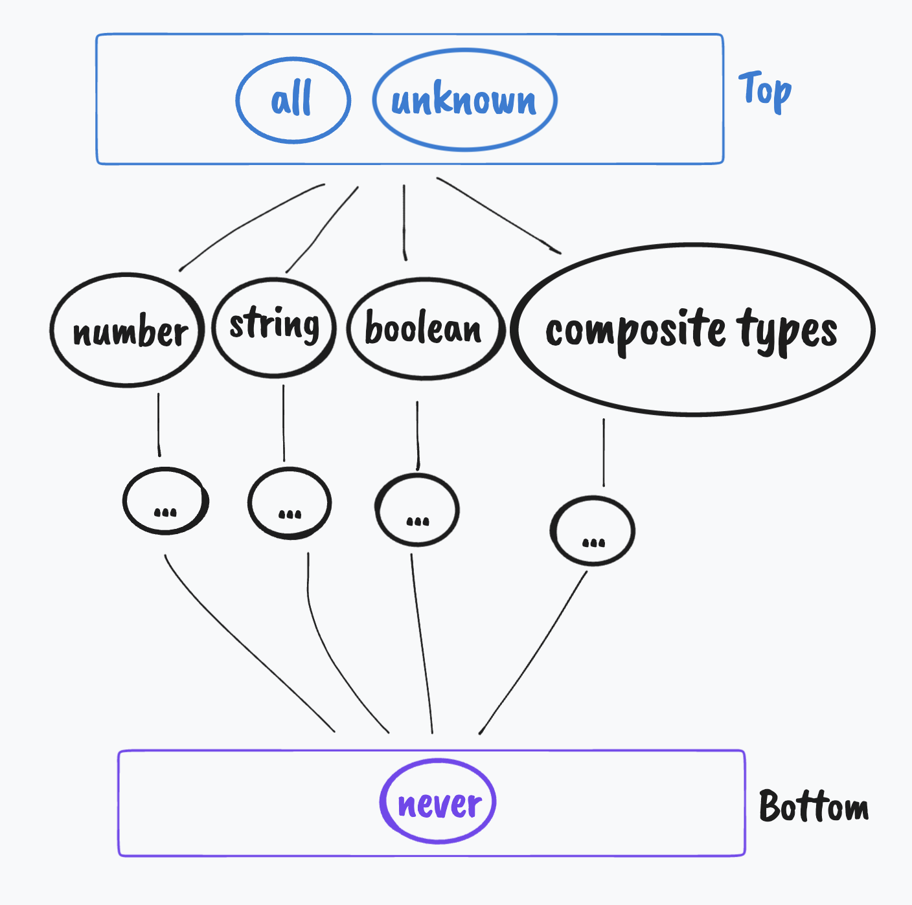

## Resources

### Type-safety

- [Strict mode in TypeScript \|\| help your compiler help you — an article by Andrey Goncharov](https://blog.goncharov.page/strict-mode-in-typescript-or-help-your-compiler-help-you)

---


## Classes and Interfaces

Without defining a constructor there is no way to check if a given attribute
(of actual type `string`) is in a certain object (that is a member of some given class)
if the object is empty.
TypeScript doesn't include the properties of a class in the compiled program;
to check if a given prop is in a certain object type (in a class definition one can say)
you have to use an ad-hoc generated staple object that is a member of this class
— this way the constructor will be called and it will initialize all
the properties thus `Object.keys` will not return an empty array but
an array with all properties initialized by the constructor.

Below is an example class with a constructor that initializes all class’ attributes.

```ts
class Example {
    one: string;
    two: number;
    three: number[];

    constructor() {
        this.one = 'some';
        this.two = 'example';
        this.three = 'data';
    }
}
```

Now, to check if a given string is an attribute use:

```ts
if (attr in new Example) {
    console.log(attr, 'is a property in `Example`');
}
```

If the `constructor` isn’t defined in the `Example` class,
the condition in the above `if` statement will always reject any `string` property.

To allow creating objects with custom initializing values you could improve `constructor` by adding an optional argument:

```ts
constructor(example: Partial<Example> = {}) {
    this.one = example.one || 'some';
    this.two = example.two || 'example';
    this.three = example.three || 'data';
}
```

This way you could create a new instance of this class with some custom parameters.
However, this argument is optional so it can be omitted: `new Example()`.

It is important to note that defining the argument as optional using the `?` symbol won’t work.

```ts
constructor(example?: Partial<Example>) {...}
```

If the `constructor` is defined as above then creating a new object
(`new Example()`) will result in an error of a `TypeError`:

```log
TypeError: Cannot read property '...' of undefined
```

as the argument object hasn’t been provided.\
**Setting the default value to `{}` resolves this issue.**

---


## Extracting a property from a derived class (a proposal)

*An obscure issue, but still a valuable one to consider.*

We have two classes of which one is derived from the other:

```ts
class Base {
    one: string;

    constructor() {
        this.one = 'data';
    }
}

class Derived extends Base {
    two: number;

    constructor() {
        super();
        this.two = 27;
    }
}
```

an instance of the `Derived` class:

```ts
const object: Derived = new Derived();
```

We want to extract properties that are defined by `Base` class from
this `object` and remove all that are defined by the `Derived` class.
In this case we want to get an object with only the `one` property.

```ts
const objectExtracted: Base = new Base();
```

The first solution would be to loop through all properties of
the `object` properties and assign all values to properties that exist
in `objectExtracted`’s type which is the `Base` class.

We need to define a [*predicate function*](https://www.typescriptlang.org/docs/handbook/advanced-types.html#using-type-predicates) that states whether a given string property name is an actual property name:

```ts
class Base {
    ...

    public static hasKey(val: any): val is keyof Base {
        return val in new Base();
    }
}
```

This function creates a staple instance of the `Base` class that contains
all of its properties (it is important to define a proper `constructor`
for this class — more [here](#classes-and-interfaces-in-typescript))
and checks whether the provided string is an actual object key.

However, the following code isn’t enough:

```ts
for (const prop in object) {
    if(Base.hasKey(prop)) {
        objectExtracted[prop] = object[prop];
    }
}
```

as it will bring up an error that some type can’t be cast to the type “`never`”.
This type exists because of uncertainty which type should be used here when accessing a property of `objectExtracted`.

The solution is to define a function which *extracts* a given property
from one object to another whilst at the same time **being type-safe**:

```ts
export function ExtractProperty<T1, T2 extends T1, K extends keyof T2>(
  target: T1, source: T2, property: K, hasKey: (val: any) => val is keyof T1): void {
  if (hasKey(property)) {
    target[property] = source[property];
  }
}
```

This function assigns the property value from the `source` object
to `target` only if `target` has a property of the same name.
This function requires using a predicate which makes sure the object keys are handled properly.

*This function essentially moves the problem to an abstract level at which it resolves the type uncertainty issue.*

Now, we can rewrite our loop:

```ts
for (const prop in object) {
    if(Base.hasKey(prop)) {
        ExtractProperty(objectExtracted, object, prop, Base.hasKey);
    }
}
```

so it uses the `ExtractProperty` function.

---


## Type hierarchy, difference between `void`, `null`, etc.

TypeScript introduces a set of rules that define relationships between all
types found in the language.

\
_The main spine of the type relations tree._

Apart from the “truthy” values, there are also “negative” values in JS.
TypeScript introduces a few more of these and also establishes a set of
relations between all of them.

---

|             | `any` | `unknown` | `object` | `void` | `undefined` | `null` | `never` |
| ----------- | ----- | --------- | -------- | ------ | ----------- | ------ | ------- |
| `any`       |       | Y         | Y        | Y      | Y           | Y      | N       |
| `unknown`   | Y     |           | N        | N      | N           | N      | N       |
| `object`    | Y     | Y         |          | N      | N           | N      | N       |
| `void`      | Y     | Y         | N        |        | N           | N      | N       |
| `undefined` | Y     | Y         | Y'       | Y      |             | Y'     | N       |
| `null`      | Y     | Y         | Y'       | Y'     | Y'          |        | N       |
| `never`     | Y     | Y         | Y        | Y      | Y           | Y      |         |

- Y — _row_ is assignable to _column_
- Y' — same as Y but only when `strictNullChecks` is turned off
- N — _row_ is not assignable to _column_

_The table of relations between various “negative” values in TS._
_It shows types of variables (columns) that accept types of values (rows)._


Sources:
- [The type hierarchy tree — zhenghao.io](https://www.zhenghao.io/posts/type-hierarchy-tree)
- [TypeScript Documentation — Type compatibility](https://www.typescriptlang.org/docs/handbook/type-compatibility.html#any-unknown-object-void-undefined-null-and-never-assignability)

---


## `infer`

The `infer` is used for extracting a type that is not directly available
or has an `import`able definition.

For example, when a function `f` expects an argument of certain type `T`,
and this type `T` has not been marked for export in this function `f`’s module,
use `infer` to extract type `T`.

```ts
import { f } from 'module'

type T = typeof f extends (arg: infer T) => any ? T : never


const x: T = {
    one: 21,
    two: 37,
}

// […]

f(x) // no type errors
```

This way you can extract the exact type given function expects.
The source article presents an example that benefits greatly from this functionality.

Because
```ts
x: number[]
```
and
```ts
y: [number, number]
```
do not have equal types, one `x` cannot be accepted as an `y` substitute.

Thus
```ts
const g = (x: {a: [number, number]}) => x.a[0] + ', ' + x.a[1]


const a = [2137, 1448]

g({a})
```
generates an error.

```log
TS2322: Type 'number[]' is not assignable to type '[number, number]'.
Target requires 2 element(s) but source may have fewer.
```

The _key_ word here is _“may”_ — another example of TS’s great type-safety system.

---

_Source article: [Understanding `infer` in TypeScript](https://blog.logrocket.com/understanding-infer-typescript/)_

---


